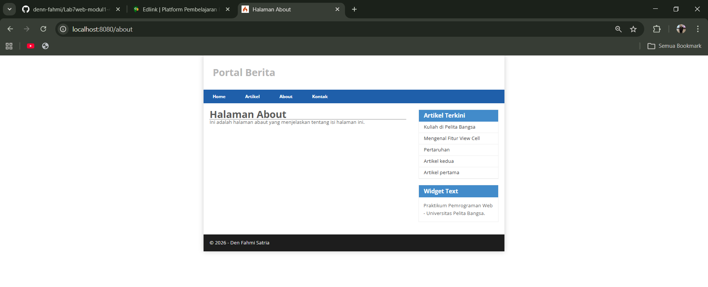
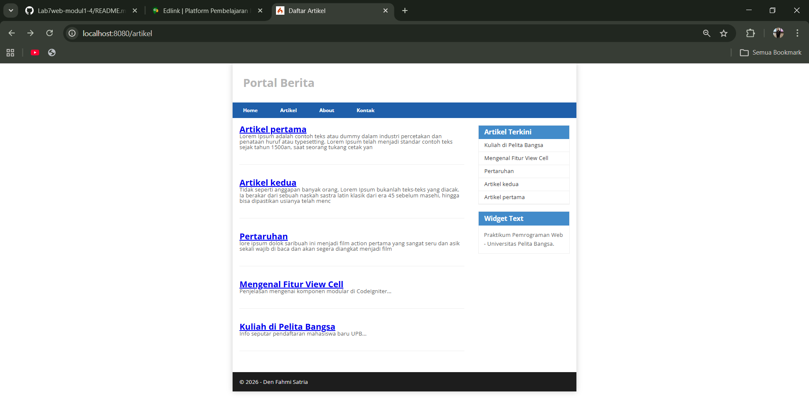
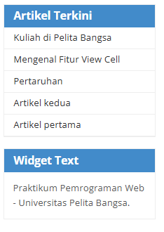
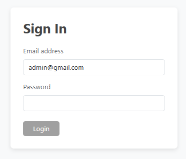
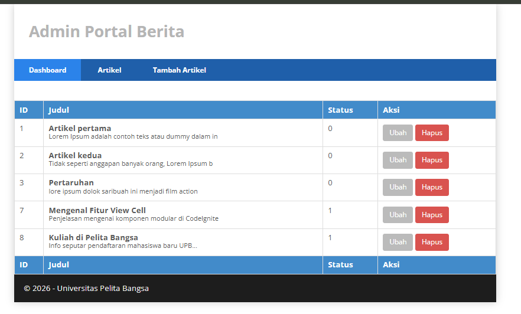

# Lab7web-modul1-4
# Laporan Praktikum Pemrograman Web 2 - Lab7Web

Repository ini merupakan dokumentasi tugas praktikum mata kuliah Pemrograman Web 2 yang berfokus pada pengembangan aplikasi web menggunakan **Framework CodeIgniter 4**.

## Identitas Mahasiswa
* **Nama:** [Den Fahmi Satria]
* **NIM:** [312410523]
* **Kelas:** [I241E]
* **Mata Kuliah:** Pemograman Web 2

---

## Ringkasan Praktikum

### Praktikum 1: PHP Framework (CodeIgniter 4)
Pada modul ini, dilakukan persiapan lingkungan kerja dan instalasi CodeIgniter 4. Fokus utama adalah memahami struktur folder CI4 dan konsep **MVC (Model, View, Controller)**. 
* **Langkah Kerja:** Mengaktifkan ekstensi PHP (intl, mysqli), mengonfigurasi file `.env`, membuat Controller `Page.php`, dan menerapkan teknik *layouting* sederhana (header & footer).
* **Hasil:** Halaman statis (Home, About, Contact) yang sudah terintegrasi dengan template.

 

---

### Praktikum 2: Framework Lanjutan (CRUD)
Modul ini membahas cara menghubungkan aplikasi dengan database MySQL dan mengelola data secara dinamis.
* **Langkah Kerja:** Membuat database `lab_ci4`, membuat tabel `artikel`, mengonfigurasi koneksi database di `.env`, dan membuat **Model** untuk menangani query data. Implementasi fitur tambah, ubah, dan hapus data (CRUD) dilakukan pada Controller Artikel.
* **Hasil:** Aplikasi dapat menampilkan daftar artikel dari database dan melakukan manipulasi data.

 

---

### Praktikum 3: View Layout dan View Cell
Modul ini memperkenalkan fitur canggih dari CI4 untuk efisiensi tampilan (UI).
* **Langkah Kerja:** Menggunakan **View Layout** (Template Inheritance) dengan perintah `renderSection` dan `extend` agar struktur HTML lebih modular. Selain itu, mengimplementasikan **View Cell** untuk membuat komponen yang bisa dipanggil di mana saja (seperti widget "Artikel Terkini").
* **Hasil:** Struktur kode View yang lebih bersih dan komponen UI yang dapat digunakan kembali (*reusable*).

 

---

### Praktikum 4: Framework Lanjutan (Modul Login)
Modul terakhir fokus pada keamanan aplikasi melalui sistem autentikasi.
* **Langkah Kerja:** Membuat tabel `user`, membuat modul registrasi dan login menggunakan **Session**. Mengamankan rute admin menggunakan **Filters (Auth)**, sehingga halaman manajemen artikel tidak dapat diakses tanpa login terlebih dahulu.
* **Hasil:** Sistem login yang berfungsi dan proteksi halaman admin.

> **Screenshot Praktikum 4:**
> 
> (Taruh Screenshot Halaman Login & Dashboard Admin di sini)
 

 

---

